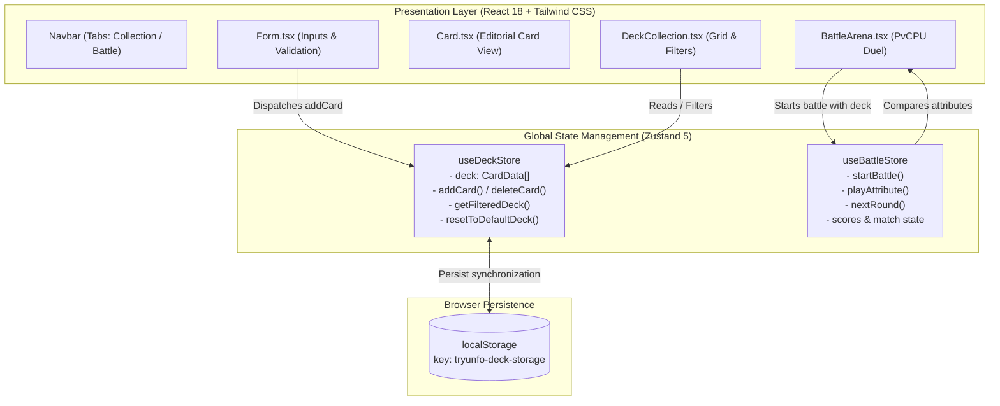

# 🎴 Tryunfo

[](https://www.typescriptlang.org/)
[](https://react.dev/)
[](https://tailwindcss.com/)
[](https://zustand-demo.pmnd.rs/)
[](https://vitejs.dev/)
[](https://vitest.dev/)
[](https://opensource.org/licenses/MIT)

> 🇧🇷 [**Versão em Português**](README.md) | 🇺🇸 **English**

An interactive web application for creating collectible cards and engaging in battle duels inspired by the classic Top Trumps (Super Trunfo) card game, built with React 18, TypeScript, Tailwind CSS, and reactive state management powered by Zustand.

## 📌 Quick Navigation

- [📝 About the Project](#-about-the-project)
- [🖼️ Preview](#️-preview)
- [🌐 Application Deployment](#-application-deployment)
- [⚡ API Endpoints](#-api-endpoints)
- [✨ Features](#-features)
- [🛠️ Technologies and Tools](#️-technologies-and-tools)
- [🏛️ Solution Architecture](#️-solution-architecture)
- [📁 Repository Structure](#-repository-structure)
- [💡 Technical Decisions](#-technical-decisions)
- [🚀 How to Run the Project](#-how-to-run-the-project)
- [📄 License](#-license)

## 📝 About the Project

**Tryunfo** is a platform combining a minimalist editorial aesthetic (inspired by the *Paradigm Shift* template) with strategic card game mechanics. The application allows users to build and manage custom decks adhering to strict balancing rules (individual attribute ceilings and total points cap) and play strategic matches against the computer in **Battle Mode**, where each round challenges the player to pick their most competitive attribute against the opponent's hidden card.

## 🖼️ Preview

<div align="center">
  
</div>

## 🌐 Application Deployment

Access the production application:  
👉 **[Tryunfo](https://tryunfo-opal.vercel.app/)**

## ⚡ API Endpoints

As a Single Page Application (SPA) with a purely client-side architecture, Tryunfo does not depend on an external REST server for its standard operations.

Data persistence is handled locally in the browser via the **Web Storage API (`localStorage`)**, abstracted by the **Zustand `persist` middleware**:

| Channel / Resource | Type | Format | Description |
| :--- | :--- | :--- | :--- |
| `tryunfo-deck-storage` | `localStorage` | JSON (`CardData[]`) | Persistence of cards created, modified, or restored by the user |
| `Unsplash / External CDNs` | `HTTPS GET` | Image Stream | Fetching and rendering of external photography and artwork for card visuals |

## ✨ Features

- **Card Creation with Real-Time Validation**:
  - Balanced distribution: maximum individual score of 90 per attribute (Attack, Defense, Agility) and a maximum total sum of 210 points.
  - Real-time countdown of remaining points available for allocation.
  - Uniqueness constraint: only 1 legendary **Super Trunfo** card permitted per active deck.
- **Instant Live Preview**:
  - Real-time card synchronization as the form inputs change.
  - Editorial presentation with high-contrast grayscale imagery and hover color reveals.
- **Deck & Collection Management**:
  - Reactive search by card name, rarity tier filter (*Normal*, *Rare*, *Very Rare*), and dedicated Super Trunfo toggle.
  - Card deletion with automatic status recomputation for Super Trunfo eligibility.
  - One-click restore button for the default balanced deck.
- **Interactive Battle Arena (PvCPU)**:
  - Automatic deck shuffling and equal distribution between Player and CPU.
  - Strategic attribute selection against the opponent's hidden card.
  - Classic Super Trunfo rule: a Super Trunfo card beats standard cards automatically.
  - Round-by-round scoreboard tracking remaining deck cards and celebratory confetti on victory.

## 🛠️ Technologies and Tools

| Layer / Purpose | Technology | Description |
| :--- | :--- | :--- |
| **Primary Language** | **TypeScript 5.7.3** | Strict type safety for data models, card attributes, and stores |
| **UI Library** | **React 18.3.1** | Modern functional components, hooks, and declarative rendering |
| **Styling & Layout** | **Tailwind CSS 3.4.17** | Editorial design system, refined typography, and responsive grid |
| **State Management** | **Zustand 5.0.3** | Lightweight global store with granular reactivity and persistence |
| **Build Tooling** | **Vite 6.1.0** | Ultra-fast development server and optimized bundling via native ESM |
| **Automated Testing** | **Vitest 3.0.5 & Testing Library** | Unit and component testing suite running in a JSDOM environment |
| **Icon Package** | **Lucide React 0.475.0** | Clean, lightweight vector iconography for user interface |
| **Visual Effects** | **Canvas Confetti 1.9.3** | Victory celebration animations rendered through HTML5 canvas |

## 🏛️ Solution Architecture



## 📁 Repository Structure

```text
project-tryunfo/
├── public/
│   ├── favicon.svg          # Monochromatic vector icon for the project
│   └── robots.txt           # Search engine crawling directives
├── src/
│   ├── components/          # Application UI components
│   │   ├── __tests__/       # Component unit tests with Testing Library
│   │   │   └── Form.test.tsx
│   │   ├── BattleArena.tsx  # Interactive PvCPU battle arena
│   │   ├── Card.tsx         # Card visual presentation with editorial styles
│   │   ├── DeckCollection.tsx # Card grid with search bar and filters
│   │   ├── Form.tsx         # Dynamic validation form with limits calculation
│   │   └── Navbar.tsx       # Navigation bar and view switching
│   ├── data/
│   │   └── defaultDeck.ts   # Balanced default deck with 6 pre-configured cards
│   ├── store/               # Global state stores powered by Zustand
│   │   ├── __tests__/       # Store unit test files
│   │   │   ├── useBattleStore.test.ts
│   │   │   └── useDeckStore.test.ts
│   │   ├── useBattleStore.ts# Battle Mode state machine
│   │   └── useDeckStore.ts  # Deck store integrated with LocalStorage
│   ├── test/
│   │   └── setup.ts         # Vitest environment setup and jest-dom matchers
│   ├── types/
│   │   └── card.ts          # Core TypeScript interfaces, rarities, and constants
│   ├── App.tsx              # Root component and editorial layout
│   ├── index.css            # Tailwind directives and custom button/input classes
│   └── index.tsx            # React 18 entry point (createRoot)
├── index.html               # Main HTML entry file with Google Fonts
├── package.json             # Project dependencies and script commands
├── postcss.config.js        # PostCSS configuration for Tailwind
├── tailwind.config.js       # Design tokens inspired by Paradigm Shift
├── tsconfig.json            # TypeScript compiler configuration
└── vite.config.ts           # Build pipeline and Vitest configuration
```

## 💡 Technical Decisions

- **Vite replacing Create React App**: CRA previously introduced severe bundle bloat and locked node engine constraints. Moving to Vite 6 reduced development startup time to under 300ms while generating lean production artifacts.
- **Strict Typing with TypeScript**: Centralized typings (`CardData`, `CardAttributeKey`) ensure type safety across form validations, store mutations, and the battle logic.
- **Zustand for State Management**: Eliminated unnecessary prop-drilling without introducing the boilerplate overhead of Redux. Built-in `persist` middleware guarantees transparent synchronization with browser storage.
- **Editorial Design (Paradigm Shift Style)**: Avoided generic neon patterns in favor of an elegant, publication-inspired interface with *Raleway* headings, *Source Sans Pro* typography, and high-contrast grayscale imagery.
- **Vitest Test Runner**: Seamlessly leverages the same compilation pipeline as Vite, ensuring fast and reliable test execution for business rules and visual components.

## 🚀 How to Run the Project

### Prerequisites
- **Node.js** (version 18 or higher recommended)
- **npm** or preferred package manager

### Installation and Execution

```bash
# 1. Clone the repository
git clone https://github.com/ludson96/project-tryunfo.git

# 2. Enter the project directory
cd project-tryunfo

# 3. Install project dependencies
npm install

# 4. Start the local development server
npm run dev
```

Open `http://localhost:5173` in your browser to view the application.

### Running Automated Tests

```bash
# Run test suite once
npm run test

# Run tests in interactive watch mode
npm run test:watch
```

### Creating a Production Build

```bash
npm run build
```

Optimized static distribution files will be generated inside the `dist/` directory.

## 📄 License

This project is licensed under the terms of the [MIT License](LICENSE).

<div align="center">
  Developed by <strong>Ludson Pereira dos Santos</strong> 🚀<br />
  <a href="https://www.linkedin.com/in/ludson96/">LinkedIn</a> • <a href="https://github.com/ludson96">GitHub</a> • <a href="mailto:ludson_ps27@hotmail.com">E-mail</a>
</div>
