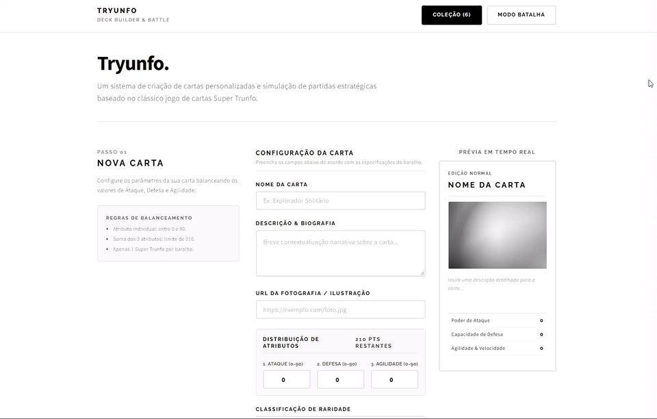
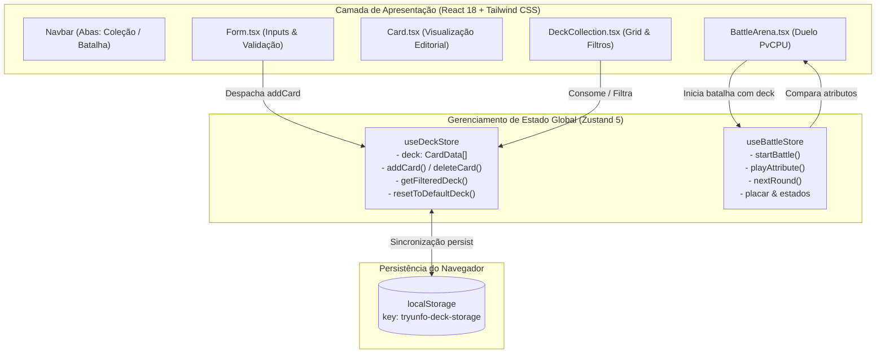

# 🎴 Tryunfo

[](https://www.typescriptlang.org/)
[](https://react.dev/)
[](https://tailwindcss.com/)
[](https://zustand-demo.pmnd.rs/)
[](https://vitejs.dev/)
[](https://vitest.dev/)
[](https://opensource.org/licenses/MIT)

> 🇧🇷 **Português** | 🇺🇸 [**English Version**](README.en.md)

Aplicação web interativa de criação de cartas colecionáveis e arena de duelo inspirada no clássico jogo Super Trunfo, desenvolvida com React 18, TypeScript, Tailwind CSS e gerenciamento de estado reativo com Zustand.

## 📌 Navegação Rápida

- [📝 Sobre o Projeto](#-sobre-o-projeto)
- [🖼️ Preview](#️-preview)
- [🌐 Deploy da Aplicação](#-deploy-da-aplicação)
- [⚡ API Endpoints](#-api-endpoints)
- [✨ Funcionalidades](#-funcionalidades)
- [🛠️ Tecnologias e Ferramentas Utilizadas](#️-tecnologias-e-ferramentas-utilizadas)
- [🏛️ Arquitetura da Solução](#️-arquitetura-da-solução)
- [📁 Estrutura do Repositório](#-estrutura-do-repositório)
- [💡 Decisões Técnicas](#-decisões-técnicas)
- [🚀 Como Executar o Projeto](#-como-executar-o-projeto)
- [📄 Licença](#-licença)

## 📝 Sobre o Projeto

O **Tryunfo** é uma plataforma que une o design editorial minimalista (inspirado no template *Paradigm Shift*) à mecânica estratégica de jogos de cartas. A aplicação permite que o usuário crie seu próprio baralho personalizado respeitando regras estritas de balanceamento numérico (limite individual por atributo e teto da soma de pontos) e dispute partidas dinâmicas contra a máquina no **Modo Batalha**, onde cada rodada desafia o jogador a escolher o atributo mais competitivo de sua carta contra a carta oculta do oponente.

## 🖼️ Preview

<div align="center">
  
</div>

## 🌐 Deploy da Aplicação

Acesse a aplicação em produção:  
👉 **[Tryunfo](https://tryunfo-opal.vercel.app/)**

## ⚡ API Endpoints

Por se tratar de uma Single Page Application (SPA) com arquitetura puramente *client-side*, o Tryunfo não depende de um servidor REST externo para suas operações cotidianas. 

A persistência de dados é gerenciada no próprio navegador via **Web Storage API (`localStorage`)**, utilizando a camada de abstração do **Zustand (`persist` middleware)**:

| Canal / Recurso | Tipo | Formato | Descrição |
| :--- | :--- | :--- | :--- |
| `tryunfo-deck-storage` | `localStorage` | JSON (`CardData[]`) | Persistência de cartas criadas, modificadas ou restauradas pelo usuário |
| `Unsplash / External CDNs` | `HTTPS GET` | Image Stream | Resolução e renderização de fotografias e ilustrações externas das cartas |

## ✨ Funcionalidades

- **Criação de Cartas com Validação em Tempo Real**:
  - Balanceamento rigoroso: pontuação máxima individual de 90 por atributo (Ataque, Defesa, Agilidade) e soma total máxima de 210 pontos.
  - Indicador visual dinâmico com contagem decrescente de pontos restantes para distribuição.
  - Regra de unicidade: permissão de apenas 1 carta lendária **Super Trunfo** por baralho ativo.
- **Prévia Instantânea**:
  - Atualização simultânea da carta durante a digitação no formulário.
  - Estilização diferenciada com fotos em escala de cinza e realce interativo ao passar o mouse.
- **Gerenciamento de Baralho & Coleção**:
  - Filtro reativo por nome, classificação por raridade (*Normal*, *Raro*, *Muito Raro*) e filtro exclusivo para Super Trunfo.
  - Exclusão de cartas com recomputação automática do status de Trunfo.
  - Botão de restauração rápida para o baralho inicial balanceado.
- **Modo Batalha Interativo (PvCPU)**:
  - Embaralhamento e divisão equilibrada do baralho entre Jogador e Adversário.
  - Mecânica de escolha de atributo estratégico contra a carta oculta da CPU.
  - Regra clássica de Trunfo: carta Super Trunfo derrota automaticamente cartas comuns.
  - Placar rodada a rodada com contagem de cartas restantes e celebração visual na vitória.

## 🛠️ Tecnologias e Ferramentas Utilizadas

| Camada / Finalidade | Tecnologia | Descrição |
| :--- | :--- | :--- |
| **Linguagem Principal** | **TypeScript 5.7.3** | Tipagem estrita de contratos, atributos de cartas e stores |
| **Biblioteca de Interface** | **React 18.3.1** | Componentes funcionais modernos, hooks e renderização declarativa |
| **Estilização e Layout** | **Tailwind CSS 3.4.17** | Design system editorial, tipografia tipográfica e layout responsivo |
| **Gerenciador de Estado** | **Zustand 5.0.3** | Store global leve com reatividade granular e middleware de persistência |
| **Ferramenta de Build** | **Vite 6.1.0** | Empacotamento ultrarrápido com Hot Module Replacement (HMR) |
| **Testes Automatizados** | **Vitest 3.0.5 & Testing Library** | Suite de testes unitários e de componentes em ambiente JSDOM |
| **Pacote de Ícones** | **Lucide React 0.475.0** | Ícones vetoriais leves e consistentes para interface |
| **Efeitos Visuais** | **Canvas Confetti 1.9.3** | Feedback comemorativo renderizado via canvas HTML5 |

## 🏛️ Arquitetura da Solução



## 📁 Estrutura do Repositório

```text
project-tryunfo/
├── public/
│   ├── favicon.svg          # Ícone monocromático vetorial do projeto
│   └── robots.txt           # Configurações de indexação de busca
├── src/
│   ├── components/          # Componentes visuais da aplicação
│   │   ├── __tests__/       # Testes unitários com Testing Library
│   │   │   └── Form.test.tsx
│   │   ├── BattleArena.tsx  # Arena interativa de combate contra CPU
│   │   ├── Card.tsx         # Componente de carta com tipografia editorial
│   │   ├── DeckCollection.tsx # Grid de cartas com barra de busca e filtros
│   │   ├── Form.tsx         # Formulário com cálculo dinâmico de limites
│   │   └── Navbar.tsx       # Barra de navegação e alternância de abas
│   ├── data/
│   │   └── defaultDeck.ts   # Baralho inicial balanceado com 6 cartas padrão
│   ├── store/               # Gerenciamento de estado global com Zustand
│   │   ├── __tests__/       # Testes unitários dos stores
│   │   │   ├── useBattleStore.test.ts
│   │   │   └── useDeckStore.test.ts
│   │   ├── useBattleStore.ts# Máquina de estados do Modo Batalha
│   │   └── useDeckStore.ts  # Store do baralho integrado ao LocalStorage
│   ├── test/
│   │   └── setup.ts         # Configuração de ambiente e matchers do Vitest
│   ├── types/
│   │   └── card.ts          # Interfaces, tipos de raridade e constantes
│   ├── App.tsx              # Componente raiz e layout modular
│   ├── index.css            # Diretivas do Tailwind e classes de botões/inputs
│   └── index.tsx            # Ponto de entrada React 18 (createRoot)
├── index.html               # Ponto de entrada HTML com fontes do Google
├── package.json             # Dependências e scripts do projeto
├── postcss.config.js        # Configuração do PostCSS para Tailwind
├── tailwind.config.js       # Tokens de design inspirados no Paradigm Shift
├── tsconfig.json            # Configurações do compilador TypeScript
└── vite.config.ts           # Configuração de build e integração Vitest
```

## 💡 Decisões Técnicas

- **Abandono do Create React App em prol do Vite**: O projeto original possuía dependências presas ao Node 16 e builds lentos. A migração para Vite 6 garantiu inicialização do ambiente de desenvolvimento em menos de 300ms e builds enxutos em ES Modules nativos.
- **Tipagem Estrita com TypeScript**: A definição centralizada de `CardData` e `CardAttributeKey` garante que nenhum atributo inválido ou fora dos limites numéricos transite entre o formulário, o store e a arena de batalha.
- **Adoção do Zustand**: Substituiu a necessidade de prop-drilling excessivo mantendo uma arquitetura limpa sem a verbosidade do Redux. A persistência via middleware `persist` sincroniza alterações em tempo real no `localStorage`.
- **Design Editorial (Estilo Paradigm Shift)**: Em substituição aos padrões genéricos com excesso de brilhos neon, adotou-se uma estética limpa, com tipografia combinada de *Raleway* e *Source Sans Pro*, contrastes monocromáticos e fotos em escala de cinza com revelação ao hover.
- **Vitest como Suite de Testes**: Proporciona execução ultrarrápida aproveitando as mesmas transformações de código do Vite, cobrindo regras de negócio dos stores e integridade dos componentes de tela.

## 🚀 Como Executar o Projeto

### Pré-requisitos
- **Node.js** (versão 18 ou superior recomendada)
- **npm** ou gerenciador de pacotes equivalente

### Instalação e Execução

```bash
# 1. Clone o repositório
git clone https://github.com/ludson96/project-tryunfo.git

# 2. Acesse a pasta do projeto
cd project-tryunfo

# 3. Instale as dependências
npm install

# 4. Inicie o servidor de desenvolvimento
npm run dev
```

Abra `http://localhost:5173` no seu navegador para visualizar a aplicação.

### Executando os Testes Automatizados

```bash
# Executar a suite de testes uma vez
npm run test

# Executar os testes em modo interativo (watch)
npm run test:watch
```

### Gerando o Build de Produção

```bash
npm run build
```

Os arquivos estáticos otimizados serão gerados na pasta `dist/`.

## 📄 Licença

Este projeto está licenciado sob os termos da [Licença MIT](LICENSE).

<div align="center">
  Desenvolvido por <strong>Ludson Pereira dos Santos</strong> 🚀<br />
  <a href="https://www.linkedin.com/in/ludson96/">LinkedIn</a> • <a href="https://github.com/ludson96">GitHub</a> • <a href="mailto:ludson_ps27@hotmail.com">E-mail</a>
</div>
